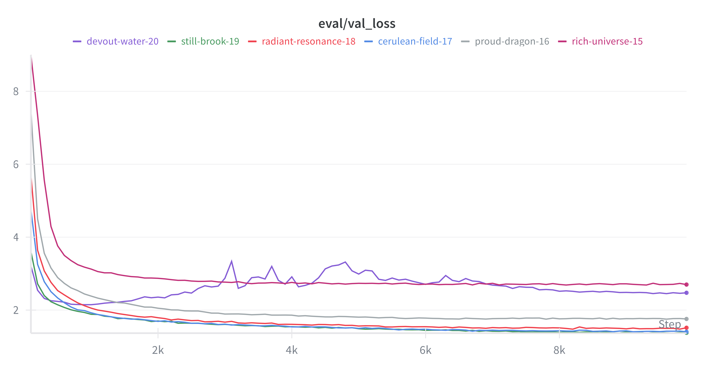

# CS336 Assignment 1

## Byte-Pair Encoding (BPE) Tokenizer

### Understanding Unicode

(a) What Unicode character does `chr(0)` return?

```text
>>> chr(0)
'\x00'
```

(b) How does this character’s string representation (`__repr__()`) differ from its printed representation?

`__repr__()` returns a string representation that shows escape sequences, but its printed representation (with print()) outputs the actual character, which is a literal null byte and is invisible.

### Unicode Encodings

(a) What are some reasons to prefer training our tokenizer on UTF-8 encoded bytes, rather than UTF-16 or UTF-32? It may be helpful to compare the output of these encodings for various input strings.

```python
text = "A你😀"

# UTF-8 - uses 1-4 bytes for each character
print(len(text))  # 3 characters
print(len(encoded))  # 8 bytes
print(encoded.hex())

# UTF-16 - uses 2 bytes for most characters, 4 bytes for rare ones
encoded = text.encode('utf-16-le')  # little-endian
print(len(encoded))  # 8 bytes
# 'A' = 2 bytes
# '你' = 2 bytes
# '😀' = 4 bytes (surrogate pair)

# UTF-32 - uses 4 bytes for each character
encoded = text.encode('utf-32-le')  # little-endian
print(len(encoded))  # 12 bytes (3 × 4)
```

UTF-32 is easier to access (character N is at byte 4N), but is very wasteful for English and Latin characters, which are usually represented with 1 byte under UTF-8.

(b) Consider the following (incorrect) function, which is intended to decode a UTF-8 byte string into a Unicode string. Why is this function incorrect? Provide an example of an input byte string
that yields incorrect results.

```python
def decode_utf8_bytes_to_str_wrong(bytestring: bytes):
  return "".join([bytes([b]).decode("utf-8") for b in bytestring])
  
>>> decode_utf8_bytes_to_str_wrong("hello".encode("utf-8"))
'hello'
```

UTF-8 is a multi-byte encoding (many characters are represented in 2-4 characters). The above erroneous function decodes each byte individually.

Example that fails:

```text
>>> text = "你好"
>>> encoded = text.encode("utf-8")
>>> encoded
b'\xe4\xbd\xa0\xe5\xa5\xbd'

>>> decode_utf8_bytes_to_str_wrong(encoded)
Traceback (most recent call last):
  File "<stdin>", line 1, in <module>
  File "<stdin>", line 2, in decode_utf8_bytes_to_str_wrong
UnicodeDecodeError: 'utf-8' codec can't decode byte 0xe4 in position 0: unexpected end of data
```

(c) Give a two byte sequence that does not decode to any Unicode character(s).

```python
b'\x80\x80'.decode('utf-8')
```

This sequence has an invalid start byte - two-byte sequences will have \xC3 as the start byte.

### BPE Tokenizer Training

See `train_bpe_tokenizer_parallel` in [`tokenization.py`](./cs336_basics/tokenization.py). The naive implementation is also included.

### BPE Training on TinyStories

(a) Train a byte-level BPE tokenizer on the TinyStories dataset, using a maximum vocabulary size of 10,000. Make sure to add the TinyStories `<|endoftext|>` special token to the vocabulary. Serialize the resulting vocabulary and merges to disk for further inspection. How many hours and memory did training take? What is the longest token in the vocabulary? Does it make sense?

On the TinyStories `train` dataset, BPE tokenizer training took a total of 904 seconds (~15 minutes). It reaached peak memory of 7738 MB.

The longest token in the vocabulary is `' accomplishment'`. This makes sense - it has a leading space, which is what we expect from the regex-based GPT-2 pre-tokenizer. It's a complete English word, of 15 bytes long, which seems typical for a vocab size of 10,000. `grep -oi "accomplishment" data/TinyStoriesV2-GPT4-train.txt | wc -l` shows that there's 1516 occurrences of "accomplishment", which seems to be a moderately high frequency.

### BPE Training on OpenWebText

(todo)

### Implementing the tokenizer

See [tokenizer.py](./cs336_basics/tokenizer.py).

### Experiments with tokenizers

(todo)

## Transformer Language Model Architecture

### Implementing the core modules

- Linear
- Embedding
- RMSNorm
- Positionwise FFN with SwiGLU
- Rotary positional embeddings (RoPE)
- Softmax

See [`transformer/core.py`](./cs336_basics/transformer/core.py).

### Implementing attention modules

- Scaled dot-product attention
- Causal multi-head self-attention
- Transformer block
- Full Transfomer language model

See [`transformer/transformer.py`](./cs336_basics/transformer/transformer.py).

### Transformer resource accounting

(a) Consider GPT-2 XL, which has the following configuration:

```text
vocab_size: 50,257
context_length: 1,024
num_layers: 48
d_model: 1,600
num_heads: 25
d_ff: 6,400
```

Suppose we constructed our model using this configuration. How many trainable parameters would our model have? Assuming each parameter is represented using single-precision floating point, how much memory is required to just load this model?

Token embeddings has shape `(vocab_size, d_model)`, total 50,257 x 1,600 = 80,411,200 parameters.

Each transformer block contains:

- 2 RMSNorm modules, each with a weight vector of shape `(d_model,)`, totaling 3,200 parameters
- 1 multi-headed attentio module, with `q_proj`, `k_proj`, `v_proj`, and `output_proj`, each a `(d_model, d_model)` matrix. Total 4 x 1,600 x 1,600 = 10,240,000 parameters for attention.
- 1 SwiGLU FFN module, with `w1`, `w2`, `w3` matrices of shapes `(d_model, d_ff)`, `(d_ff, d_model)`, `(d_model, d_ff)` respectively. Here we have 3 x 1,600 x 6,400 = 30,720,000 parameters

So for each block, we have 40,963,200 parameters. We have 48 such blocks, so this adds up to 1,966,233,600 parameters.

Then we have the final RMSNorm layer of `(d_model,)` shape and the LM head, a fully-collected network with a `(vocab_size, d_model)` matrix, add 1,600 and 80,411,200 parameters to the count.

Thus the whole Transformer network has 80,411,200 + 1,966,233,600 + 1,600 + 80,411,200 = 2,127,057,600 trainable parameters.

Single-precision floating point requires 4 bytes per parameter, so this would require around 8.5 billion bytes, or roughly 8GB of memory to load the model.

Note: this is just for storing the model. We'd still need memory for gradients, optimizer states, activations/intermediate values. The total training memory for Adam optimizer would be roughly 4x the model size = 32GB.

(b) Identify the matrix multiplies required to complete a forward pass of our GPT-2 XL-shaped model. How many FLOPs do these matrix multiplies require in total? Assume that our input sequence has `context_length` tokens.

For each of the 48 attention block, we have:

- 4 attention projections (`q_proj`, `k_proj`, `v_proj`, `output_proj`), each with `(1, 1024, 1600) @ (1600, 1600)`
- `Q @ K^T` with 25 heads: `(1, 25, 1024, 64) @ (1, 25, 64, 1024)`
- `attention @ V` with 25 heads: `(1, 25, 1024, 1024) @ (1, 25, 1024, 64)`
- SwiGLU FFN:
  - `w1`: `(1, 1024, 1600) @ (1600, 6400)`
  - `w2`: `(1, 1024, 6400) @ (6400, 1600)`
  - `w3`: `(1, 1024, 1600) @ (1600, 6400)`

Then we have the LM head: `(1, 1024, 1600) @ (1600, 50257)`.

```text
num_layers * (8 * batch_size * seq_len * d_model^2
        + 16 * batch_size * seq_len * d_model
        + 4 * batch_size * seq_len^2 * d_model
        + 6 * batch_size * num_heads * seq_len^2
        + 6 * batch_size * seq_len * d_model * d_ff)
    + 4 * batch_size * seq_len * d_model + 2 * batch_size * seq_len * d_model * vocab_size
```

See docstrings in respective components for FLOPs calcuations. This is the full FLOPs calculation, including nonlinear operations.

Plugging in the values, we have:

```text
48 * (
    20971520000
    + 26214400
    + 6710886400
    + 157286400
    + 62914560000
) + 6553600 + 164682137600 = 4,522,151,116,800
```

The forward pass requires around 4.5 teraflops.

(c) Based on your analysis above, which parts of the model require the most FLOPs?

1. SwiGLU FFN takes up ~3.02T/4.5T FLOPs, or 66.7% of total FLOPs.
2. Attention projections takes up ~1.00T FLOPS, or 22.2% of total FLOPs.

(d) Repeat your analysis with GPT-2 small (12 layers, 768 `d_model`, 12 heads), GPT-2 medium (24 layers, 1024 `d_model`, 16 heads), and GPT-2 large (36 layers, 1280 `d_model`, 20 heads). As the model size increases, which parts of the Transformer LM take up proportionally more or less of the total FLOPs?

I created a function to calculate FLOPs with detailed breakdowns given a model config, see [`transformer/flops.py`](./cs336_basics/transformer/flops.py).

GPT-2 small:

```text
FLOPs breakdown by component:
============================================================
feedforward              : 173,946,175,488 (49.60%)
lm_head                  :  79,047,426,048 (22.54%)
attention_projections    :  57,982,058,496 (16.53%)
attention_mechanism      :  38,654,705,664 (11.02%)
attention_softmax        :     905,969,664 ( 0.26%)
layer_norms              :      78,643,200 ( 0.02%)
attention_rope           :      56,623,104 ( 0.02%)
residual_adds            :      18,874,368 ( 0.01%)
============================================================
TOTAL                    : 350,690,476,032 (100.00%)
============================================================
```

GPT-2 medium:

```text
FLOPs breakdown by component:
============================================================
feedforward              : 618,475,290,624 (59.74%)
attention_projections    : 206,158,430,208 (19.91%)
lm_head                  : 105,396,568,064 (10.18%)
attention_mechanism      : 103,079,215,104 ( 9.96%)
attention_softmax        :   1,811,939,328 ( 0.18%)
layer_norms              :     205,520,896 ( 0.02%)
attention_rope           :     150,994,944 ( 0.01%)
residual_adds            :      50,331,648 ( 0.00%)
============================================================
TOTAL                    : 1,035,328,290,816 (100.00%)
============================================================
```

GPT-2 large:

```text
FLOPs breakdown by component:
============================================================
feedforward              : 1,449,551,462,400 (64.05%)
attention_projections    : 483,183,820,800 (21.35%)
attention_mechanism      : 193,273,528,320 ( 8.54%)
lm_head                  : 131,745,710,080 ( 5.82%)
attention_softmax        :   4,529,848,320 ( 0.20%)
layer_norms              :     382,730,240 ( 0.02%)
attention_rope           :     283,115,520 ( 0.01%)
residual_adds            :      94,371,840 ( 0.00%)
============================================================
TOTAL                    : 2,263,044,587,520 (100.00%)
============================================================
```

GPT-2 XL:

```text
FLOPs breakdown by component:
============================================================
feedforward              : 3,019,898,880,000 (66.78%)
attention_projections    : 1,006,632,960,000 (22.26%)
attention_mechanism      : 322,122,547,200 ( 7.12%)
lm_head                  : 164,682,137,600 ( 3.64%)
attention_softmax        :   7,549,747,200 ( 0.17%)
layer_norms              :     635,699,200 ( 0.01%)
attention_rope           :     471,859,200 ( 0.01%)
residual_adds            :     157,286,400 ( 0.00%)
============================================================
TOTAL                    : 4,522,151,116,800 (100.00%)
============================================================
```

The proportion of FLOPs by the LM head dramatically decreases. This is because the LM head scales with `(d_model, vocab_size)`. `vocab_size` is fixed here, so even though `d_model` increases, its effect is less significant in larger models.

In larger models, the proportion of FLOPs by attention projections increase significantly. Attention projections scale quadratically (`d_model^2`).

Feedforward is the largest contributor to FLOPs but its proportion is steadily increases. FLOPs here scale as `d_model x d_ff`, and `d_ff` is typically set as a fixed multiple of `d_model` (in the above calculations, we use a multiple of 4). It grows at the same rate as attention projections.

Proportion of FLOPs by the attention mechanism now decreases with model size as it scales as `seq_len^2 x d_model`. Here, `seq_len` is fixed, so its growth is slower than FFN and attention projections.

(e) Take GPT-2 XL and increase the context length to 16,384. How does the total FLOPs for one forward pass change? How do the relative contribution of FLOPs of the model components change?

Here's the new FLOPs breakdown for GPT-2 XL:

```text
FLOPs breakdown by component:
============================================================
attention_mechanism      : 82,463,372,083,200 (54.44%)
feedforward              : 48,318,382,080,000 (31.90%)
attention_projections    : 16,106,127,360,000 (10.63%)
lm_head                  : 2,634,914,201,600 ( 1.74%)
attention_softmax        : 1,932,735,283,200 ( 1.28%)
layer_norms              :  10,171,187,200 ( 0.01%)
attention_rope           :   7,549,747,200 ( 0.00%)
residual_adds            :   2,516,582,400 ( 0.00%)
============================================================
TOTAL                    : 151,475,768,524,800 (100.00%)
============================================================
```

Now, the attention mechanism has the largest proportion of total FLOPs. It is the only component that scales as `seq_len^2 x d_model`.

## Training a Transformer LM

### Cross entropy

See [`training/loss.py`](./cs336_basics/training/loss.py).

### Tuning the learning rate

As we will see, one of the hyperparameters that affects training the most is the learning rate. Let’s see that in practice in our toy example. Run the SGD example above with three other values for the learning rate: 1e1, 1e2, and 1e3, for just 10 training iterations. What happens with the loss for each of these learning rates? Does it decay faster, slower, or does it diverge (i.e., increase over the course of training)?

```text
Learning rate: 1
Iter 0: 26.902851104736328
Iter 1: 25.83749771118164
Iter 2: 25.11186981201172
Iter 3: 24.5352840423584
Iter 4: 24.04703140258789
Iter 5: 23.618789672851562
Iter 6: 23.234670639038086
Iter 7: 22.884723663330078
Iter 8: 22.56222915649414
Iter 9: 22.262401580810547
----------
Learning rate: 10.0
Iter 0: 23.941246032714844
Iter 1: 15.322395324707031
Iter 2: 11.295016288757324
Iter 3: 8.837143898010254
Iter 4: 7.158086776733398
Iter 5: 5.934873580932617
Iter 6: 5.005279064178467
Iter 7: 4.277153491973877
Iter 8: 3.6936583518981934
Iter 9: 3.2175867557525635
----------
Learning rate: 100.0
Iter 0: 23.233997344970703
Iter 1: 23.233997344970703
Iter 2: 3.986323356628418
Iter 3: 0.09540168941020966
Iter 4: 1.4710455605678916e-16
Iter 5: 1.639571545946337e-18
Iter 6: 5.521014413545769e-20
Iter 7: 3.288906062324567e-21
Iter 8: 2.8214361270811258e-22
Iter 9: 3.134929450815956e-23
----------
Learning rate: 1000.0
Iter 0: 16.56375503540039
Iter 1: 5979.515625
Iter 2: 1032756.3125
Iter 3: 114883120.0
Iter 4: 9305532416.0
Iter 5: 587285659648.0
Iter 6: 30149328240640.0
Iter 7: 1297153137836032.0
Iter 8: 4.781029603881779e+16
Iter 9: 1.535241763671769e+18
```

At a low learning rate, like 1.0, the loss converges slowly. This is significantly faster with learning rate at 10.

At a high learning rate (e.g, 100 or 1000), loss decreases quickly initially but begin to diverge. For 100, it oscillates around the minimum point, but at 1000 the loss diverges drastically.

### AdamW optimizer

See [`training/optimizer.py`](./cs336_basics/training/optimizer.py).

Resource accounting: (todo)

### Cosine LR scheduler, gradient clipping

See [`training/optimizer.py`](./cs336_basics/training/optimizer.py).

## Training Loop

- Data loader: [`training/data.py`](./cs336_basics/training/data.py)
- Model checkpointing: [`training/checkpoint.py`](./cs336_basics/training/checkpoint.py)

The training loop is implemented on the Trainer class ([`training/trainer.py`](./cs336_basics/training/trainer.py)). [`train.py`](./cs336_basics/train.py) is a script accepting arguments to start model training. Configs are defined in [`config/`](./cs336_basics/config/).

First, create the tokenized datasets.

```bash
uv run python -m cs336_basics.tokenize_data \
    --vocab results/TinyStoriesV2_GPT4_train_vocab.pkl \
    --merges results/TinyStoriesV2_GPT4_train_merges.pkl \
    --input data/TinyStoriesV2-GPT4-train.txt \
    --output tokenized_data/TinyStoriesV2-GPT4-train.npy

uv run python -m cs336_basics.tokenize_data \
    --vocab results/TinyStoriesV2_GPT4_train_vocab.pkl \
    --merges results/TinyStoriesV2_GPT4_train_merges.pkl \
    --input data/TinyStoriesV2-GPT4-valid.txt \
    --output tokenized_data/TinyStoriesV2-GPT4-valid.npy
```

The TinyStories training set has 541M tokens.

To train the model locally:

```bash
uv run python -m cs336_basics.train

# Override multiple settings
uv run python -m cs336_basics.train \
    --config-override '{"model": {"d_model": 256, "num_layers": 4}, "optimizer": {"max_lr": 1e-3}}'

# Or from a file
uv run python -m cs336_basics.train \
    --config-override "$(cat my_config.json)"
```

Modal provides GPUs to help accelerate training. See [train_modal.py](./cs336_basics/train_modal.py) for container setup and serverless function definitions.

```bash
# Setup
uv run modal setup
uv run wandb login

uv run modal secret create wandb-secret WANDB_API_KEY=...

# Create modal volume and copy tokenized datasets
uv run modal volume create cs336-data
uv run modal volume put cs336-data tokenized_data/TinyStoriesV2-GPT4-train.npy TinyStoriesV2-GPT4-train.npy
uv run modal volume put cs336-data tokenized_data/TinyStoriesV2-GPT4-valid.npy TinyStoriesV2-GPT4-valid.npy

# Run the training script
uv run modal run cs336_basics/train_modal.py
```

## Generating Text

See `generate()` in the [Transformer class](./cs336_basics/transformer/transformer.py).

## Experiments

### Tune the learning rate

(a) Perform a hyperparameter sweep over the learning rates and report the final losses (or note divergence if the optimizer diverges).

I performed a logarithmic grid search over these learning rate values: [1e-4, 3e-4, 6e-4, 1e-3, 3e-3, 6e-3].

Results:

| Run name | LR | Final Val Loss | Notes |
|----------|----|----------------|-------|
| rich-universe-15 | 1e-4 | 2.70 | Underfitting, LR too low |
| proud-dragon-16 | 3e-4 | 1.76 | Still slow convergence |
| radiant-resonance-18 | 6e-4 | 1.48 | Good |
| cerulean-field-17 | 1e-3 | 1.40 | Good |
| still-brook-19 | 3e-3 | 1.38 | ⭐️ Best |
| devout-water-20 | 6e-3 | 2.46 | Unstable, with grad norms 30-100+ |



(b) Folk wisdom is that the best learning rate is “at the edge of stability.” Investigate how the point at which learning rates diverge is related to your best learning rate.

The best LR is 3e-3, which is right at the edge before 6e-3 becomes unstable and divergent. This is consistent with the folk wisdom that pushing the LR as high as possible without diverging gives the best results.

### Generate text

```bash
uv run python -m cs336_basics.generate
```

Generated text: (temperature=0.7, top-p=0.9):

> Once upon a time, there was a little boy named Tim. Tim had a toy car that he loved to play with every day. One day, he saw a big hill and wanted to go up it. He asked his mom, "Can I go up the hill?"
>
>His mom said, "No, Tim. You can't go up the hill. It is too high." But Tim was stubborn and did not listen to his mom. He tried to climb the hill, but he was too small.
>
> Tim tried and tried, but he could not get to the top. He was sad. His mom saw him and said, "Don't worry, Tim. You can try again." Tim tried again and again. He got to the top and climbed the hill. He was happy and his mom was proud of him.
> <|endoftext|>
>
>(170 tokens generated)

The output is highly fluent - it's grammatically correct, has a coherent structure (setup, conflict, resolution), very appropriate for the TinyStories domain (simple children's stories).

Temperature can be a factor that affects output quality, compare the above output with these:

With temperatue=0.0, top-p=1.0:

> Once upon a time, there was a little girl named Lily. She loved to play with her toys and have fun. One day, she found a big, red ball in her room. She was very happy and wanted to play with it.
>
>Lily took the ball outside to play. She threw it up in the air and caught it. She threw it high in the air and caught it. Lily laughed and clapped her hands. She played with the ball all day long.
>
> But then, something unexpected happened. The ball went too high and got stuck in a tree. Lily tried to get it down, but she could not reach it. She was sad and cried. Her mom came and helped her get the ball down. Lily learned that she should not play with things that are not hers.
> <|endoftext|>
>
> (163 tokens generated)

At lower temperature, the story seems to be more coherent, but we can see repetitive and short sentence structures.

With temperatue=1.0, top-p=0.9:

>Once upon a time there was a generous dog named Bob. Bob had a cane that he loved very much. He would carry the cane everywhere he went.
>
> One day, Bob found his cane near a girl. The girl said, "Bob, if you do not carry my cane, or your chain will come out!" Bob felt sad but he did try again.
>
> Bob walked up to the girl and said, "Please help me!" The girl smiled and said, "Thank you!" Bob willing to help the girl get her cane back. They became good friends and played together all day. And Bob learned that it is always good to help others.
> <|endoftext|>
>
> (170 tokens generated)

Here, we see that the output is more "creative" but is less coherent (grammatical error, story makes less sense).

Another factor that affects output quality is the training data itself. The model is only trained on simple children's stories, so its output will be of that genre and it will be unable to generate text outside of this distribution.

### Ablations and architecture modification

(todo)
